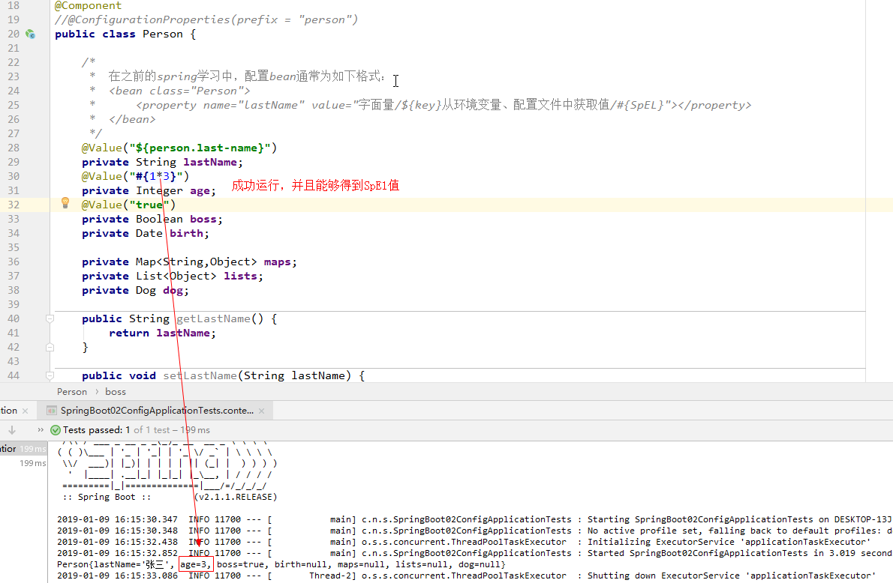

## 1.两者比较结果

|                      | @ConfigurationProperties | @Value     |
| -------------------- | ------------------------ | ---------- |
| 功能                 | 批量注入配置文件中的属性 | 一个个注入 |
| 松散绑定（松散语法） | 支持                     | 不支持     |
| SpEL                 | 不支持                   | 支持       |
| JSR303数据校验       | 支持                     | 不支持     |
| 复杂类型封装         | 支持                     | 不支持     |

## 2.功能比较

### 2.1 @ConfigurationProperties批量注入属性值

（1）如果使用@ConfigurationProperties，则需要编写下面的代码

```java
@Component
@ConfigurationProperties(prefix = "person")
public class Person {

    private String lastName;
    private Integer age;
    private Boolean boss;
    private Date birth;

    private Map<String,Object> maps;
    private List<Object> lists;
    private Dog dog;
    //添加set/get方法
```

其中application.properties属性文件为：

```pro
#在properties中配置person的属性

person.last-name=张三
person.age=20
person.boss=true
person.birth=2019/1/9
person.maps.k1=v1
person.maps.k2=v2
person.lists=a,b,c
person.dog.name=金毛
person.dog.age=3
```

这种方式能够一次性为所有属性字段赋值。

### 2.2 @Value一个个赋值

如果使用@Value方式，那么就需要将这个Person类修改为如下形式

```java
@Component
//@ConfigurationProperties(prefix = "person")
public class Person {

    /*
     *  在之前的spring学习中，配置bean通常为如下格式：
     *  <bean class="Person">
     *      <property name="lastName" value="字面量/${key}从环境变量、配置文件中获取值/#{SpEL}"></property>
     *  </bean>
     */
    @Value("${person.last-name}")
    private String lastName;
    @Value("${person.age}")
    private Integer age;
    @Value("true")
    private Boolean boss;
    private Date birth;

    private Map<String,Object> maps;
    private List<Object> lists;
    private Dog dog;
```

使用@Value，那么就需要为每一个属性定义一个@Value

## 3.松散绑定

person.last-name与person.lastName是一个意思

属性名匹配规则（Relaxed binding）

- person.firstName：使用标准方式
- person.first-name：大写用–
- person.first_name：大写用_
- PERSON_FIRST_NAME： 推荐系统属性使用这种写法 

### 3.1 @ConfigurationProperties

在前面的代码中，如果使用@Config方式，进行测试后的结果如图所示：


### 3.2 @Value

还是在前面的代码的基础上，使用进行下面的操作


## 4.SpEL

### 4.1@ConfigurationProperties

 在application.properties中，修改下面显示的内容，并运行代码


### 4.2 @Value

将上面修改的部分的age属性值仍修改会18。在person类型中进行下面的修改。




## 5.JSR303数据校验

### 5.1 @ConfigurationProperties

在person类中进行如下操作


### 5.2 @Value

同样修改Person类


## 6.复杂类型封装

### 6.1 @ConfigurationProperties

最明显能够证明其对复杂类型的支持，可以看Person类中的Map类


### 6.2 @value

在Person类中，使用@Value来获取Map属性。


## 7.总结

以上便是对于两种方式的比较，大多数情况下使用的是@ConfigurationProperties方式，但是如果需要但是获取某一个属性的值，可以使用@Value。

以上实验代码在 ：[源码](https://github.com/xfljm/springboot01)